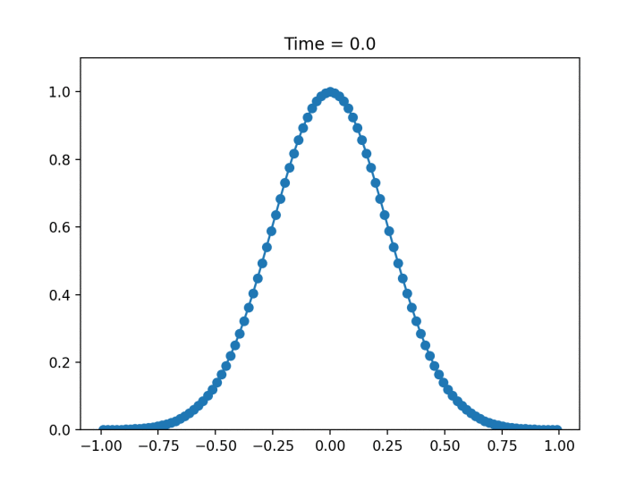

# wave-equation
Wave equation solver in python.

Evolution of a gaussian package with o initial velocity

We solve the 1D wave equation

$$\frac{\partial^2}{\partial t^2} u(t,x) = c^2 \frac{\partial^2}{\partial {x^2}} u(t,x)$$

where $x,~t$ denote respectively space and time, $u$ is the unknown solution and $c$ is the 
characteristic speed.
